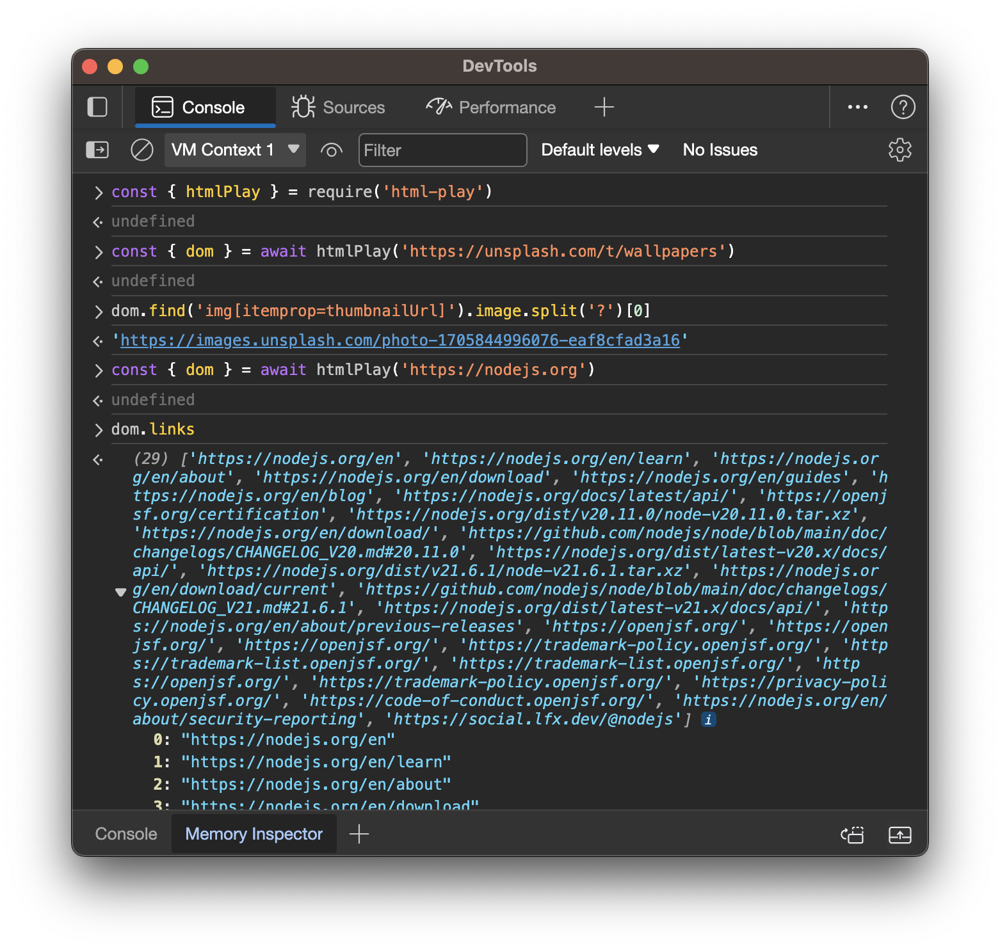

<h1 align="center">HTML-Play</h1>

<p align="center">
  <a href="https://www.npmjs.com/package/html-play" title="HTML-Play on NPM">
    
  </a>
  <a href="https://github.com/arianrhodsandlot/html-play" title="HTML-Play on GitHub">
    
  </a>
</p>

<p align="center">
  Fetch and parse web pages with Node.js like a boss 🕶.
</p>

<p align="center">
  
</p>

## Features
+ Intuitive APIs for extracting useful contents like links and images.
+ CSS selectors.
+ Mocked user-agent (like a real web browser).
+ Full JavaScript support.
  ```js
  await htmlPlay(url, { browser: true })
  ```
  Using Chromium under the hood by default, thanks to [Playwright](https://playwright.dev)

## Recipes
+ Grab a list of all links and images on the page.
  ```js
  import { htmlPlay } from 'html-play'

  const { dom } = await htmlPlay('https://nodejs.org')
  // Will print all link URLs on the page
  console.log(dom.links)
  // Will print all image URLs on the page
  console.log(dom.images)
  ```

+ Select an element with a CSS selector.
  ```js
  import { htmlPlay } from 'html-play'

  const { dom } = await htmlPlay('https://nodejs.org')
  const intro = dom.find('#home-intro', { containing: 'Node' })
  // Will print: 'Node.js® is an open-source, cross-platform...'
  console.log(intro.text)
  ```

<details>
  <summary>Expand to view more recipes.</summary>

+ Let's grab some wallpapers from unsplash.
  ```js
  import { htmlPlay } from 'html-play'

  const { dom } = await htmlPlay('https://unsplash.com/t/wallpapers')
  const elements = dom.findAll('img[itemprop=thumbnailUrl]')
  const images = elements.map(({ image }) => image)
  // Will print something like
  // ['https://images.unsplash.com/photo-1705834008920-b08bf6a05223', ...]
  console.log(images)
  ```
+ Let's load some hacker news from Hack News.
  ```js
  import { htmlPlay } from 'html-play'

  const { dom } = await htmlPlay('https://news.ycombinator.com')
  const titles = dom.findAll('.titleline')
  const news = titles.map(({ text, link }) => [text, link])
  // Will print something like
  // [['news 1', 'http://xxx.com'], ['news 2', 'http://yyy.com'], ...]
  console.log(news)
  ```
+ Load a dynamic website, which means its content is generated by JavaScript!
  ```js
  // Search for images of "flower" with Google
  import { htmlPlay } from 'html-play'

  const { dom } = await htmlPlay('https://www.google.com/search?&q=flower&tbm=isch', { browser: true })
  // Filtering is still needed if you want this work...
  console.log(dom.images)
  ```
+ Send requests with custom cookies.
  ```js
  import { htmlPlay } from '../src/index.js'

  const { dom } = await htmlPlay('https://httpbin.org/cookies', {
    fetch: { fetchInit: { headers: { Cookie: 'a=1; b=2;' } } },
  })
  // Will print { "cookies": { "a": "1", "b": "2" } }
  console.log(dom.text)
  ```
</details>

## Installation
```sh
npm i html-play
```
If you want to use a browser to "run" the page before parsing, you'll need to install Chromium with Playwright.
```sh
npx playwright install chromium
```

## APIs
+ ### Methods
  #### `htmlPlay`

  Fetch a certain URL and return its response with the parsed DOM.

  ##### Example:
  ```js
  import { htmlPlay } from 'html-play'

  const { dom } = await htmlPlay('http://example.com')
  ```

  ##### Parameters:
  + `url`

    Type: `string`

    The URL to fetch.

  + `options` (Optional)

    Type: `object`

    Default: `{ fetch: true }`

    + `fetch` (Optional)

      Type: `boolean | object`

      Default: `true`

      If set to `true`, we will use [the Fetch API](https://developer.mozilla.org/en-US/docs/Web/API/fetch) to load the requested URL. You can also specify the options for [the Fetch API](https://developer.mozilla.org/en-US/docs/Web/API/fetch) by passing an `object` here.

      + `fetcher` (Optional)

        Type: `function`

        The fetch function we are going to use. We can pass a polyfill here.

      + `fetchInit` (Optional)

        Type: `function`

        The fetch parameters passed to the fetch function. See [fetch#options](https://developer.mozilla.org/en-US/docs/Web/API/fetch#options). You can set HTTP headers or cookies here.

    + `browser` (Optional)

      Type: `boolean | object`

      Default: `false`

      If set to `true`, we will use Playwright to load the requested URL. You can also specify the options for Playwright by passing an `object` here.

      + `browser` (Optional)

        Type: `object`

        [The Playwright Browser instance](https://playwright.dev/docs/api/class-browser) to use.

      + `page` (Optional)

        Type: `object`

        [The Playwright Page instance](https://playwright.dev/docs/api/class-page) to use.

      + `launchOptions` (Optional)

        The `launchOptions` passed to Playwright when we are launching the browser. See [BrowserType#browser-type-launch](https://playwright.dev/docs/api/class-browsertype#browser-type-launch)

      + `beforeNavigate` (Optional)

        A custom hook function that will be called before the page is loaded. `page` and `browser` can be accessed here as the properties of its first parameter to interact with the page.

      + `afterNavigate` (Optional)

        A custom hook function that will be called after the page is loaded. `page` and `browser` can be accessed here as the properties of its first parameter to interact with the page.

  ##### Returns:
  A `Promise` of the [`Response`](#Response) instance (see below).

+ ### Classes
  #### `Response`
  ##### Properties
  + `url`

    Type: `string`

    The URL of the response. If the response is redirected from another URL, the value will be the final redirected URL.

  + `status`

    Type: `number`

    The HTTP status code of the response.

  + `content`

    Type: `string`

    The response content as a plain string.

  + `dom`

    Type: `object`

    The parsed root DOM. See [`DOMElement`](#DOMElement).

  + `rawBrowserResponse`

    Type: `object`

    The raw response object returned by Playwright.

  + `rawFetchResponse`

    Type: `object`

    The raw response object returned by [the Fetch API](https://developer.mozilla.org/en-US/docs/Web/API/fetch).

  #### `DOMElement`
  ##### Properties
  + `html`

    Type: `string`

    The "[`outerHTML`](https://developer.mozilla.org/en-US/docs/Web/API/Element/outerHTML)" of this element.

  + `link`

    Type: `string`

    If the element is an [anchor element](https://developer.mozilla.org/en-US/docs/Web/HTML/Element/a), this will be the absolute value of the element's link, or it will be an empty string.

  + `links`

    Type: `string[]`

    All the [anchor elements](https://developer.mozilla.org/en-US/docs/Web/HTML/Element/a) inside this element.

  + `text`

    Type: `string`

    The text of the element with whitespaces stripped.

  + `rawText`

    Type: `string`

    The original text of the element.

  + `image`

    Type: `string`

    If the element is an [image embed element](https://developer.mozilla.org/en-US/docs/Web/HTML/Element/img), this will be the absolute URL of the element's image, or it will be an empty string.

  + `images`

    Type: `string[]`

    All the image URLs inside this element.

  + `backgroundImage`

    Type: `string`

    The background image source extracted from the element's inline style.

  + `element`

    Type: `object`

    The corresponding `JSDOM` element object.

  ##### Methods
  + `find`

    Find the first matched child `DOMElement` inside this element.

    ##### Parameters
    + `selector`

      Type: `string`

      The CSS selector to use.

    + `options` (Optional)

      Type: `object`

      + `containing` (Optional)

        Type: `string`

        Check if the element contains the specified substring.

        Type: `string`
  + `findAll`

    Find all matched child `DOMElement`s inside this element.

    ##### Parameters
    + `selector`

      Type: `string`

      The CSS selector to use.

    + `options` (Optional)

      Type: `object`

      + `containing` (Optional)

        Type: `string`

        Check if the element contains the specified substring.

        Type: `string`

  + `getAttribute`
    ##### Parameters
    + `qualifiedName`

      Type: `string`

      Returns element's first attribute whose qualified name is qualifiedName, and `undefined` if there is no such attribute otherwise.

## Credits
This project is highly inspired by another fabulous library [Requests-HTML](https://github.com/psf/requests-html) for Python.

## License
[MIT](licenses)
